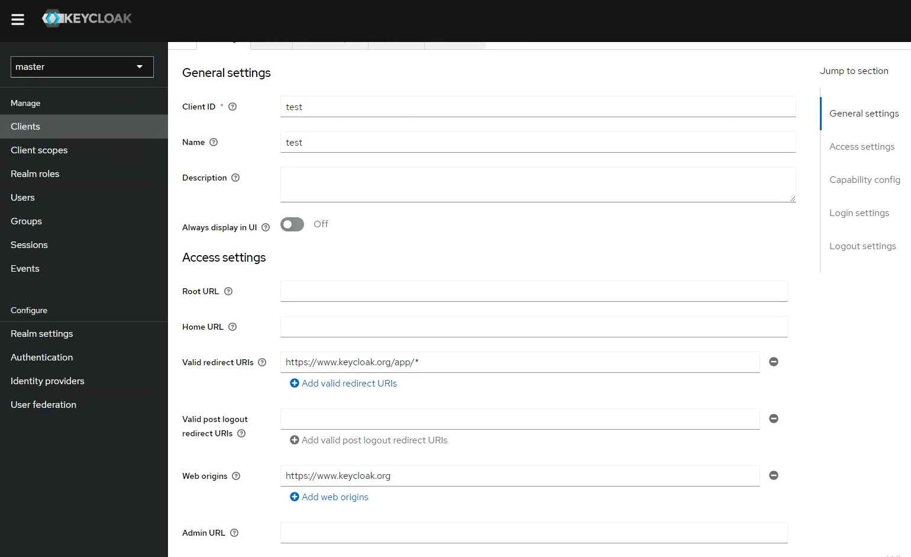
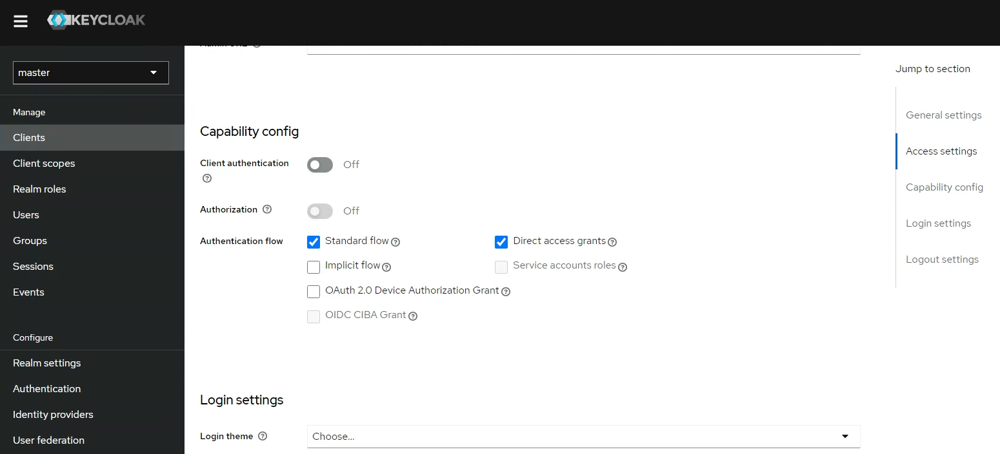
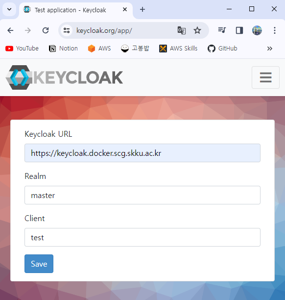
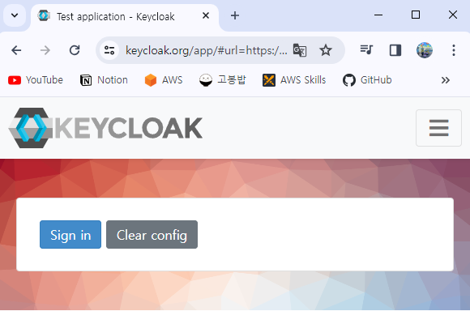
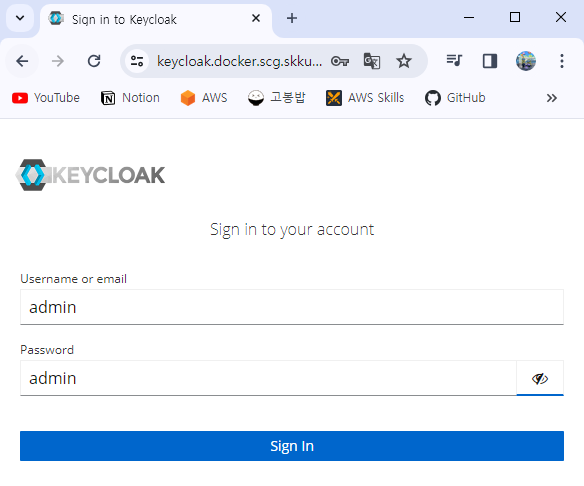
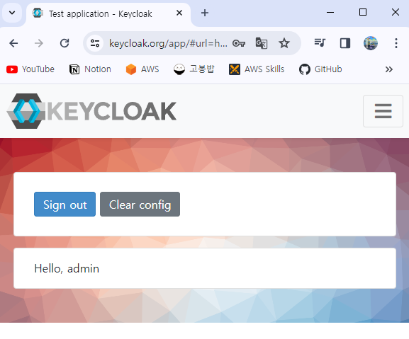

# Keycloak + Docker

## Installation

[Docker](https://www.keycloak.org/getting-started/getting-started-docker)

```bash
# Prepare your DOMAIN

# Change Username, Password in docker-compose.yaml
docker compose up -d

# Then, install Nginx & Certbot
# Change Nginx configuration (Reference : nginx.conf)
# Replace "keycloak.yourdomain.com" to your DOMAIN
sudo systemctl restart nginx
sudo certbot --nginx
```

Then, go to `https://<your DOMAIN>`

## OpenID Connect (OIDC) Test

1. Create a new Client
  - Client Type : `OpenID Connect`
  - Client ID : `test`
  - Name : `test`
  - Valid redirect URIs : `https://keycloak.org/app/*`
  - Web origins : `https://keycloak.org`





2. Go to `https://keycloak.org/app` -> Set keycloak info -> Click "Save" button
  - Keycloak URL: `https://<your DOMAIN>`
  - Realm : `master`
  - Client : `test`



3. Click "Sign in" button



4. Set Username(or email) & Password -> Click "Sign in" button



5. If everything is fine, you can check your Username

